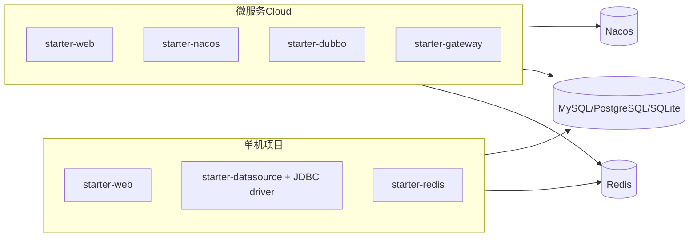

# 快速开始

kset-framework 提供两类典型接入方式，对应 **两个示例工程**：

配置示例见 [kset-demo/env](../kset-demo/env)：`component-*.yml` 为各组件配置模板，复制到业务 `application.yaml` 使用；demo 服务已内置默认配置。

| 场景 | 示例模块 | 依赖中间件 | 说明 |
|------|----------|------------|------|
| **单机项目** | [demo-standalone-service](../kset-demo/demo-standalone-service) | MySQL/PostgreSQL/SQLite、Redis | Web + DB + 缓存，无注册中心 |
| **微服务 Cloud** | demo-user / demo-order / demo-gateway | MySQL/PostgreSQL/SQLite、Redis、Nacos | Nacos + Dubbo + Gateway + 灰度 |

业务项目均继承 `kset-parent`：

```xml
<parent>
    <groupId>com.kset</groupId>
    <artifactId>kset-parent</artifactId>
    <version>1.0.0-SNAPSHOT</version>
</parent>
```

---

## 一、单机项目

适用于单体应用、内部后台、无需服务发现与 RPC 的场景。

### Maven 依赖

```xml
<dependencies>
    <dependency>
        <groupId>com.kset</groupId>
        <artifactId>kset-starter-web</artifactId>
    </dependency>
    <dependency>
        <groupId>com.kset</groupId>
        <artifactId>kset-starter-datasource</artifactId>
    </dependency>
    <dependency>
        <groupId>org.xerial</groupId>
        <artifactId>sqlite-jdbc</artifactId>
    </dependency>
    <dependency>
        <groupId>com.kset</groupId>
        <artifactId>kset-starter-redis</artifactId>
    </dependency>
    <dependency>
        <groupId>com.kset</groupId>
        <artifactId>kset-starter-monitor</artifactId>
    </dependency>
</dependencies>
```

数据源能力统一引入 `kset-starter-datasource`，数据库类型由 JDBC 驱动决定。示例默认使用 `org.xerial:sqlite-jdbc`，无需外部数据库；MySQL 或 PostgreSQL 项目可替换为 `com.mysql:mysql-connector-j` 或 `org.postgresql:postgresql`。

**不要** 引入 `starter-nacos`、`starter-dubbo`、`starter-gateway`（单机不会写入 Nacos 默认 `spring.config.import`）。

引入 `kset-starter-monitor` 后，业务代码获取 traceId 或埋点请使用 **`com.kset.common.monitor.Monitor`**（详见 [kset-starter-monitor/README.md](../kset-starter-monitor/README.md)）：

```java
import com.kset.common.monitor.Monitor;
import com.kset.common.monitor.facade.MonitorTypes;
import com.kset.common.monitor.facade.MonitorStatus;

String traceId = Monitor.currentTraceId().orElse("-");
try (var tx = Monitor.newTransaction(MonitorTypes.BIZ, "createOrder")) {
    // ...
    tx.setStatus(MonitorStatus.SUCCESS);
}
```

### 最小配置 `application.yaml`

```yaml
spring:
  application:
    name: my-app
  datasource:
    url: jdbc:sqlite:./data/kset_demo.db
  data:
    redis:
      host: localhost
      port: 6379

knife4j:
  enable: true

kset:
  datasource:
    auto-fill: true
  redis:
    key-prefix: "myapp:"
    default-ttl: 30m
```

业务侧推荐注入 **`KsetRedisService`** 或使用静态 **`KsetRedis`**（见 [kset-starter-redis/README.md](../kset-starter-redis/README.md)）。须配置 **`kset.redis.default-ttl`**（禁止永久 key）；Redisson 分布式锁默认开启，可用 **`kset.redis.redisson.enabled=false`** 关闭。示例：

```java
redisService.setEx("user:" + id, user, Duration.ofMinutes(5));
UserEntity cached = redisService.get("user:" + id, UserEntity.class);

// 静态门面（Bootstrap 绑定后）
KsetRedis.setEx("user:" + id, user, Duration.ofMinutes(5));

// 命名数据源
KsetRedis.of("cache").setEx("item:" + id, item, Duration.ofHours(1));
```

多数据源与集群（Primary 仍用 `spring.data.redis.*`）：

```yaml
spring:
  data:
    redis:
      cluster:
        nodes: redis-1:6379,redis-2:6379

kset:
  redis:
    default-ttl: 30m
    sources:
      cache:
        host: redis-cache
        port: 6379
        key-prefix: "myapp:cache:"
        pool:
          enabled: true
          max-active: 8
          max-idle: 8
          min-idle: 0
          max-wait: 2s
```

```java
public class CacheWriter {
    public CacheWriter(@Qualifier("cacheKsetRedisService") KsetRedisService cacheRedis) {
        cacheRedis.setEx("k", value, Duration.ofMinutes(10));
    }
}
```

> 单机场景**不要**引入 `starter-nacos`、`starter-dubbo`、`starter-gateway`，本地 Redis/数据源写在 `application.yaml` 即可。

### 日志（无需自建 logback）

依赖任意 KSet Starter（经 `kset-common` 传递）后，框架自动启用 `classpath:kset-logback-spring.xml`：

| Profile | 输出 |
|---------|------|
| 默认 / 本地 / `dev` | 文本控制台，含 `[traceId]` |
| `prod` / `staging` | JSON（level、traceId、logger、message、timestamp） |

- **不要**在业务工程再复制 `logback-spring.xml`。
- 完全自定义：设置 `logging.config=classpath:your-logback.xml`。
- 关闭框架默认：`kset.logging.auto-config=false`（此时使用 Spring Boot 默认 logback 发现逻辑）。

```yaml
spring:
  profiles:
    active: dev   # 本地可读日志；生产请用 prod
logging:
  level:
    root: INFO
    com.kset: DEBUG
  # test / prod 文件日志（Spring Boot 标准属性，KSet logback 模板直接消费）
  file:
    path: tmp/logs          # 实际目录：path/${spring.application.name}
  logback:
    rollingpolicy:
      max-file-size: 100MB
      max-history: 7
```

### 运行示例工程

```bash
mvn clean install
mvn -pl kset-demo/demo-standalone-service spring-boot:run
```

| 项 | 地址 |
|----|------|
| API | http://localhost:18081/api/users/1 |
| Knife4j | http://localhost:18081/doc.html |

---

## 二、微服务 Cloud 项目

适用于多服务注册发现、RPC、网关统一入口、Nacos 配置与 Sentinel/灰度治理。

### 业务微服务 Maven 依赖

```xml
<dependencies>
    <dependency>
        <groupId>com.kset</groupId>
        <artifactId>kset-starter-web</artifactId>
    </dependency>
    <dependency>
        <groupId>com.kset</groupId>
        <artifactId>kset-starter-datasource</artifactId>
    </dependency>
    <dependency>
        <groupId>org.xerial</groupId>
        <artifactId>sqlite-jdbc</artifactId>
    </dependency>
    <!-- 按需 -->
    <dependency>
        <groupId>com.kset</groupId>
        <artifactId>kset-starter-redis</artifactId>
    </dependency>
    <dependency>
        <groupId>com.kset</groupId>
        <artifactId>kset-starter-monitor</artifactId>
    </dependency>
    <dependency>
        <groupId>com.kset</groupId>
        <artifactId>kset-starter-nacos</artifactId>
    </dependency>
    <dependency>
        <groupId>com.kset</groupId>
        <artifactId>kset-starter-sentinel</artifactId>
    </dependency>
    <dependency>
        <groupId>com.kset</groupId>
        <artifactId>kset-starter-dubbo</artifactId>
    </dependency>
</dependencies>
```

业务微服务同样引入 `kset-starter-datasource`，并按实际数据库显式引入 JDBC 驱动。

> `starter-nacos` **不传递** `starter-web` / `starter-sentinel`；HTTP 与限流熔断须按需显式引入。仅 Dubbo Provider、无 REST、无 Sentinel 时可只加 `starter-dubbo`（自带 Nacos Config）。

### API Gateway（独立进程）

```xml
<dependency>
    <groupId>com.kset</groupId>
    <artifactId>kset-starter-gateway</artifactId>
</dependency>
```

> Gateway **勿** 与 `starter-web` 同进程；仅网关进程引入 gateway starter。

### 最小配置 `application.yaml`（业务服务）

```yaml
spring:
  application:
    name: order-service
  cloud:
    nacos:
      discovery:
        server-addr: ${NACOS_ADDR:127.0.0.1:8848}
        namespace: dev
        group: KSET_GROUP
      config:
        server-addr: ${NACOS_ADDR:127.0.0.1:8848}
        namespace: dev
        group: KSET_GROUP
  config:
    import: optional:nacos:${spring.application.name}.yaml
  datasource:
    url: jdbc:sqlite:./data/kset_demo.db
  data:
    redis:
      host: localhost
      port: 6379

knife4j:
  enable: true

kset:
  cloud:
    sentinel:
      enabled: true
    dubbo:
      trace-propagation-enabled: true
      gray-metadata-key: version
      default-gray-tag: stable
    loadbalancer:
      gray-header: X-Gray-Tag
      metadata-key: version

dubbo:
  application:
    name: ${spring.application.name}
  registry:
    address: nacos://${NACOS_ADDR:127.0.0.1:8848}
    register-mode: instance
  protocol:
    name: dubbo
    port: -1
```

Nacos 规则与 Gateway 路由见 [README Nacos 约定](../README.md#nacos-规则配置约定) 与 [docs/nacos/demo-gateway-routes.json](nacos/demo-gateway-routes.json)。

### 运行 Cloud 示例工程

```bash
mvn clean install
# 终端 1 - 用户服务
mvn -pl kset-demo/demo-micro-service spring-boot:run
# 终端 2 - 网关
mvn -pl kset-demo/demo-gateway spring-boot:run
```

| 服务 | 端口 | API 示例 | Knife4j |
|------|------|----------|---------|
| demo-micro-service | 18082 | `/api/users/1`、`/api/orders/1` | http://localhost:18082/doc.html |
| demo-gateway | 见 gateway 配置 | 经网关访问 | 无（不用 starter-web） |

---

## 选型对照



| 能力 | 单机 | 微服务 Cloud |
|------|:----:|:------------:|
| 统一响应 / 异常 / TraceId | 是 | 是 |
| Knife4j | 是 | 是（各业务服务） |
| MyBatis-Plus / dynamic-datasource | 是 | 是 |
| Redis | 可选 | 可选 |
| Nacos 配置/发现 | 否 | 是 |
| Dubbo RPC | 否 | 是 |
| Gateway / 灰度 LB | 否 | 是 |

更多文档：[kset-starter-web/README.md](../kset-starter-web/README.md)。
