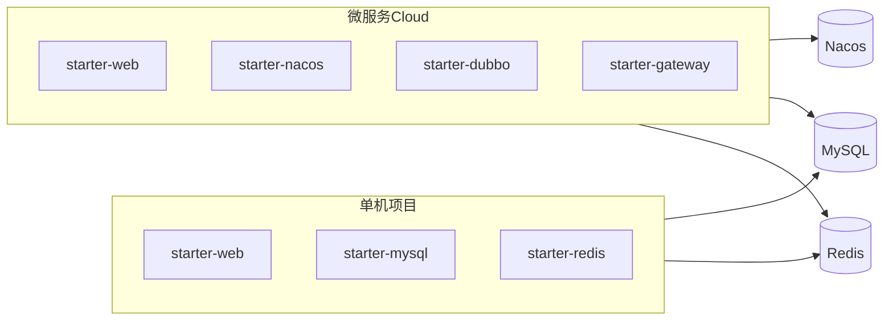

# 快速开始

kset-comm 提供两类典型接入方式，对应 **两个示例工程**：

| 场景 | 示例模块 | 依赖中间件 | 说明 |
|------|----------|------------|------|
| **单机项目** | [demo-standalone-service](../kset-demo/demo-standalone-service) | MySQL、Redis | Web + DB + 缓存，无注册中心 |
| **微服务 Cloud** | demo-user / demo-order / demo-gateway | MySQL、Redis、Nacos | Nacos + Dubbo + Gateway + 灰度 |

业务项目均继承 `kset-spring-boot-parent`：

```xml
<parent>
    <groupId>com.kset</groupId>
    <artifactId>kset-spring-boot-parent</artifactId>
    <version>1.0.0-SNAPSHOT</version>
</parent>
```

---

## 一、单机项目

适用于单体应用、内部后台、无需服务发现与 RPC 的场景。

### Maven 依赖

```xml
<dependencies>
    <dependency>
        <groupId>com.kset</groupId>
        <artifactId>kset-spring-boot-starter-web</artifactId>
    </dependency>
    <dependency>
        <groupId>com.kset</groupId>
        <artifactId>kset-spring-boot-starter-mysql</artifactId>
    </dependency>
    <dependency>
        <groupId>com.kset</groupId>
        <artifactId>kset-spring-boot-starter-redis</artifactId>
    </dependency>
</dependencies>
```

**不要** 引入 `starter-nacos`、`starter-dubbo`、`starter-gateway`。

### 最小配置 `application.yaml`

```yaml
spring:
  application:
    name: my-app
  datasource:
    url: jdbc:mysql://localhost:3306/my_db?useSSL=false&serverTimezone=UTC
    username: root
    password: root
  data:
    redis:
      host: localhost
      port: 6379

kset:
  web:
    knife4j:
      enabled: true
  mysql:
    enabled: true
    auto-fill: true
    flyway:
      enabled: true
  redis:
    key-prefix: "myapp:"
```

### 运行示例工程

```bash
mvn clean install
mvn -pl kset-demo/demo-standalone-service spring-boot:run
```

| 项 | 地址 |
|----|------|
| API | http://localhost:8080/api/users/1 |
| Knife4j | http://localhost:8080/doc.html |

---

## 二、微服务 Cloud 项目

适用于多服务注册发现、RPC、网关统一入口、Nacos 配置与 Sentinel/灰度治理。

### 业务微服务 Maven 依赖

```xml
<dependencies>
    <dependency>
        <groupId>com.kset</groupId>
        <artifactId>kset-spring-boot-starter-web</artifactId>
    </dependency>
    <dependency>
        <groupId>com.kset</groupId>
        <artifactId>kset-spring-boot-starter-mysql</artifactId>
    </dependency>
    <!-- 按需 -->
    <dependency>
        <groupId>com.kset</groupId>
        <artifactId>kset-spring-boot-starter-redis</artifactId>
    </dependency>
    <dependency>
        <groupId>com.kset</groupId>
        <artifactId>kset-spring-boot-starter-nacos</artifactId>
    </dependency>
    <dependency>
        <groupId>com.kset</groupId>
        <artifactId>kset-spring-boot-starter-dubbo</artifactId>
    </dependency>
</dependencies>
```

### API Gateway（独立进程）

```xml
<dependency>
    <groupId>com.kset</groupId>
    <artifactId>kset-spring-boot-starter-gateway</artifactId>
</dependency>
```

> Gateway **勿** 与 `starter-web` 同进程；仅网关进程引入 gateway starter。

### 最小配置 `application.yaml`（业务服务）

```yaml
spring:
  application:
    name: order-service
  cloud:
    nacos:
      discovery:
        server-addr: ${NACOS_ADDR:127.0.0.1:8848}
      config:
        server-addr: ${NACOS_ADDR:127.0.0.1:8848}
  config:
    import: optional:nacos:${spring.application.name}.yaml
  datasource:
    url: jdbc:mysql://localhost:3306/kset_demo?useSSL=false&serverTimezone=UTC
    username: root
    password: root
  data:
    redis:
      host: localhost
      port: 6379

kset:
  web:
    knife4j:
      enabled: true
  cloud:
    nacos:
      namespace: dev
      group: KSET_GROUP
    sentinel:
      enabled: true
    dubbo:
      trace-propagation-enabled: true
      gray-metadata-key: version
      default-gray-tag: stable
    loadbalancer:
      gray-header: X-Gray-Tag
      metadata-key: version

dubbo:
  application:
    name: ${spring.application.name}
  registry:
    address: nacos://${NACOS_ADDR:127.0.0.1:8848}
    register-mode: instance
  protocol:
    name: dubbo
    port: -1
```

Nacos 规则与 Gateway 路由见 [README Nacos 约定](../README.md#nacos-规则配置约定) 与 [docs/nacos/demo-gateway-routes.json](nacos/demo-gateway-routes.json)。

### 运行 Cloud 示例工程

```bash
mvn clean install
# 终端 1 - 用户服务
mvn -pl kset-demo/demo-user-service spring-boot:run
# 终端 2 - 订单服务（Dubbo 调用户 + Redis）
mvn -pl kset-demo/demo-order-service spring-boot:run
# 终端 3 - 网关
mvn -pl kset-demo/demo-gateway spring-boot:run
```

| 服务 | 端口 | API 示例 | Knife4j |
|------|------|----------|---------|
| demo-user-service | 8081 | `/api/users/1` | http://localhost:8081/doc.html |
| demo-order-service | 8082 | `/api/orders/1` | http://localhost:8082/doc.html |
| demo-gateway | 见 gateway 配置 | 经网关访问 | 无（不用 starter-web） |

---

## 选型对照



| 能力 | 单机 | 微服务 Cloud |
|------|:----:|:------------:|
| 统一响应 / 异常 / TraceId | 是 | 是 |
| Knife4j | 是 | 是（各业务服务） |
| MyBatis-Plus / Flyway | 是 | 是 |
| Redis | 可选 | 可选 |
| Nacos 配置/发现 | 否 | 是 |
| Dubbo RPC | 否 | 是 |
| Gateway / 灰度 LB | 否 | 是 |

更多文档：[openapi.md](openapi.md)。
