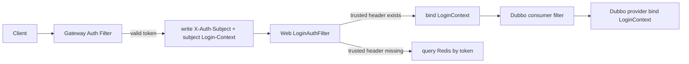

# KSet Auth Starter

`kset-starter-auth` 提供统一登录态、项目默认鉴权、多套主体鉴权、Gateway/Web/Dubbo 登录上下文透传，以及方法级登录与权限注解。

适用场景：

- App 用户登录态：普通业务接口默认使用 `app` 主体。
- CMS 后台登录态：通过路径规则切换到 `admin` 主体。
- Gateway 统一鉴权：网关根据 token 查询 session，并向下游透传轻量登录上下文。
- 服务内兜底鉴权：业务服务没有收到可信登录上下文时，可继续用 token 查询 session。
- Dubbo 内部调用：只透传当前请求登录上下文，不负责重新鉴权。

## 快速接入

业务服务和网关都引入 auth starter。默认 Redis session 实现依赖 `kset-starter-redis`。

```xml
<dependency>
    <groupId>com.kset</groupId>
    <artifactId>kset-starter-auth</artifactId>
</dependency>
```

最小配置：

```yaml
kset:
  auth:
    enabled: true
    default-subject: app
    default-scheme: session
    default-token-header: X-Session-Token
```

默认行为：

- 普通接口未命中任何规则时，按 `app + session + X-Session-Token` 鉴权。
- 公开路径默认放行：`/api/public/**`、`/actuator/health/**`、`/doc.html`、`/v3/api-docs/**`。
- 未登录返回 `{"code":401,"message":"未登录","data":null}`，HTTP 状态保持 `200`。
- 无权限返回 `{"code":403,"message":"无权限","data":null}`，HTTP 状态保持 `200`。

## 多套鉴权配置

只配置差异化场景。App 普通接口不需要写规则，会自动走项目默认鉴权。

```yaml
kset:
  auth:
    default-subject: app
    default-scheme: session
    default-token-header: X-Session-Token
    rules:
      - name: cms
        paths:
          - /cms/**
          - /api/cms/**
        subject: admin
        scheme: session
        token-header: X-Admin-Session-Token

      - name: public
        paths:
          - /api/public/**
        scheme: none
```

主体选择顺序：

1. 路径规则命中且配置了 `subject`，使用规则主体。
2. 路径规则命中但未配置 `subject`，使用 `default-subject`。
3. 未命中规则，使用项目默认鉴权。
4. 未命中规则时，可用 `X-Auth-Subject` 作为兜底覆盖；业务默认不需要传。

同一请求只绑定一个当前主体，例如 `app` 或 `admin`，不同时绑定多套登录态。

## 鉴权流程



流程说明：

- Gateway：根据路径规则决定 `app/admin/public`，按对应 token header 查询 session，成功后向下游写登录上下文。
- Web：如果当前线程已有 `LoginContext`，不重复校验；否则按规则读取可信 header 或 token。
- Dubbo：consumer 侧有登录上下文才透传；provider 侧只负责恢复上下文，调用结束后自动清理。
- 非登录态接口：配置 `scheme=none`；需要权限的接口再通过注解或业务逻辑判断。

## Header 规范

当前主体：

| Header | 说明 |
|--------|------|
| `X-Auth-Subject` | 当前登录主体，如 `app`、`admin` |

登录上下文：

| 主体 | Header |
|------|--------|
| `app` | `X-App-Login-Context` |
| `admin` | `X-Admin-Login-Context` |
| 其他主体 | `X-{Subject}-Login-Context` |

`Login-Context` 是轻量 JSON，只包含基础身份和权限字段：

- `userId`
- `subjectType`
- `userName`
- `tenantId`
- `orgId`
- `deptId`
- `roles`
- `permissions`
- `token`，默认不透传，仅 Dubbo 配置 `propagate-token=true` 时写入

设备、IP、语言等仍通过独立 Header 透传，避免登录上下文 JSON 过长：

| Header | 说明 |
|--------|------|
| `X-Device-Id` | 设备 ID |
| `X-Device-Type` | 设备类型 |
| `X-Client-Type` | 客户端类型 |
| `X-Client-Version` | 客户端版本 |
| `X-Client-Ip` | 客户端 IP |
| `X-Language` | 语言 |
| `X-Time-Zone` | 时区 |
| `X-Login-Time` | 登录时间戳 |

兼容读取旧 header：

- `X-Login-Context`
- `X-User-Id`
- `X-User-Name`
- `X-Tenant-Id`
- `X-Roles`
- `X-Permissions`

默认不再写出旧拆分身份 header。

## 业务代码使用

读取当前登录用户：

```java
LoginUser user = LoginContext.requireUser();
String userId = user.getUserId();
String subject = user.getSubjectType();
String tenantId = user.getTenantId();
```

可选读取：

```java
LoginContext.currentUser().ifPresent(user -> {
    String userId = user.getUserId();
});
```

校验当前主体：

```java
LoginUser admin = LoginContext.requireUser("admin");
```

方法级注解默认使用当前请求解析出的主体，不需要显式传 `subject`：

```java
@RequireLogin
public OrderDetail getOrder(String orderId) {
    return orderService.getOrder(orderId);
}

@RequirePermission("order:create")
public void createOrder(CreateOrderCommand command) {
    orderService.create(command);
}

@RequireRole("admin")
public void auditOrder(String orderId) {
    orderService.audit(orderId);
}
```

确实需要限定后台或 App 身份时再写 `subject`：

```java
@RequirePermission(value = "cms:user:update", subject = "admin")
public void updateCmsUser(UpdateCmsUserCommand command) {
    cmsUserService.update(command);
}
```

## 创建和保存登录态

登录接口完成账号密码、短信或第三方认证后，保存 session：

```java
@Service
public class LoginService {

    private final LoginSessionStore sessionStore;

    public LoginService(LoginSessionStore sessionStore) {
        this.sessionStore = sessionStore;
    }

    public String login(String userId) {
        String token = UUID.randomUUID().toString();
        LoginUser user = LoginUser.builder()
                .userId(userId)
                .subjectType("app")
                .userName("neo")
                .tenantId("tenant-1")
                .roles(List.of("user"))
                .permissions(List.of("order:create"))
                .build();

        sessionStore.save(token, user, Duration.ofHours(2));
        return token;
    }
}
```

客户端后续请求带 token：

```http
GET /api/orders
X-Session-Token: app-token
```

CMS 请求使用后台 token header：

```http
GET /api/cms/user/list
X-Admin-Session-Token: admin-token
```

## Session 配置

```yaml
kset:
  auth:
    session:
      key-prefix: kset:auth:session:
      ttl: 2h
      sliding-refresh-enabled: true
      refresh-threshold: 30m
```

Redis key 默认格式：

```text
kset:auth:session:{token}
```

可通过自定义 Bean 替换默认 Redis session 实现：

```java
@Bean
public LoginSessionStore loginSessionStore() {
    return new CustomLoginSessionStore();
}
```

## Web 与 Gateway 模式

Web 默认按 `session` 查询 Redis。若服务只信任 Gateway 透传，可切换为 trusted-header：

```yaml
kset:
  auth:
    web:
      mode: trusted-header
```

兼容配置：

```yaml
kset:
  auth:
    web:
      token-header: X-Session-Token
      public-paths:
        - /api/public/**
    gateway:
      token-header: X-Session-Token
      public-paths:
        - /api/public/**
```

建议新项目优先使用顶层 `default-*` 和 `rules`。

## Dubbo 透传

默认透传当前登录上下文，不透传 token：

```yaml
kset:
  auth:
    dubbo:
      enabled: true
      propagate-token: false
```

内部调用链路需要 token 时才开启：

```yaml
kset:
  auth:
    dubbo:
      propagate-token: true
```

Dubbo 规则：

- 当前线程没有 `LoginContext` 时不写 attachment。
- provider 侧从 attachment 恢复 `LoginContext`。
- 调用结束后恢复旧上下文，避免线程复用污染。

## 扩展点

| SPI | 用途 |
|-----|------|
| `LoginSessionStore` | 替换 Redis session 读写 |
| `Authenticator` | 扩展新的认证方案，如 JWT、OAuth2、API Key |
| `LoginUserHeaderCodec` | 自定义 Gateway/Dubbo 登录上下文编解码 |
| `PermissionChecker` | 自定义角色、权限、数据权限判断 |
| `ServletAuthFailureHandler` | 自定义 Servlet 未登录/无权限响应 |
| `GatewayAuthFailureHandler` | 自定义 Gateway 未登录响应 |

自定义认证器示例：

```java
@Component
public class JwtAuthenticator implements Authenticator {

    @Override
    public String scheme() {
        return "jwt";
    }

    @Override
    public AuthResult authenticate(AuthRequest request, AuthRuleMatch match) {
        String token = request.header(match.getTokenHeader());
        LoginUser user = parseJwt(token).withSubjectType(match.getSubject());
        return AuthResult.authenticated(user);
    }
}
```

配置使用：

```yaml
kset:
  auth:
    rules:
      - name: open-api
        paths:
          - /openapi/**
        subject: partner
        scheme: jwt
        token-header: Authorization
```

自定义权限检查：

```java
@Bean
public PermissionChecker permissionChecker() {
    return new RemotePermissionChecker();
}
```

## 配置总览

```yaml
kset:
  auth:
    enabled: true
    default-subject: app
    default-scheme: session
    default-token-header: X-Session-Token
    subject-header: X-Auth-Subject
    rules:
      - name: cms
        paths:
          - /api/cms/**
        subject: admin
        scheme: session
        token-header: X-Admin-Session-Token
      - name: public
        paths:
          - /api/public/**
        scheme: none
    session:
      key-prefix: kset:auth:session:
      ttl: 2h
      sliding-refresh-enabled: true
      refresh-threshold: 30m
    web:
      enabled: true
      mode: redis
      token-header: X-Session-Token
      public-paths:
        - /api/public/**
        - /actuator/health/**
        - /doc.html
        - /v3/api-docs/**
    gateway:
      enabled: true
      token-header: X-Session-Token
      public-paths:
        - /api/public/**
        - /actuator/health/**
        - /doc.html
        - /v3/api-docs/**
    dubbo:
      enabled: true
      propagate-token: false
```

## 常见组合

单体服务：

- 引入 `kset-starter-web`
- 引入 `kset-starter-auth`
- 引入 `kset-starter-redis`
- 客户端直接传 `X-Session-Token`

微服务业务服务：

- 引入 `kset-starter-web`
- 引入 `kset-starter-auth`
- 引入 `kset-starter-redis`
- 可使用 `trusted-header` 信任 Gateway，也可继续 session 兜底

Gateway：

- 引入 `kset-starter-gateway`
- 引入 `kset-starter-auth`
- 引入 `kset-starter-redis`
- 配置 CMS、public 等路径规则

Dubbo 服务：

- 引入 `kset-starter-dubbo`
- 引入 `kset-starter-auth`
- 由 auth Dubbo filter 自动透传当前登录上下文
